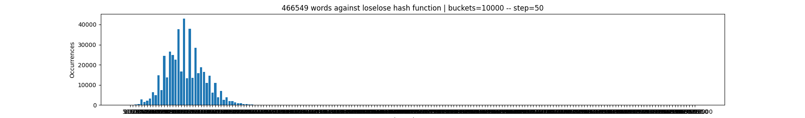
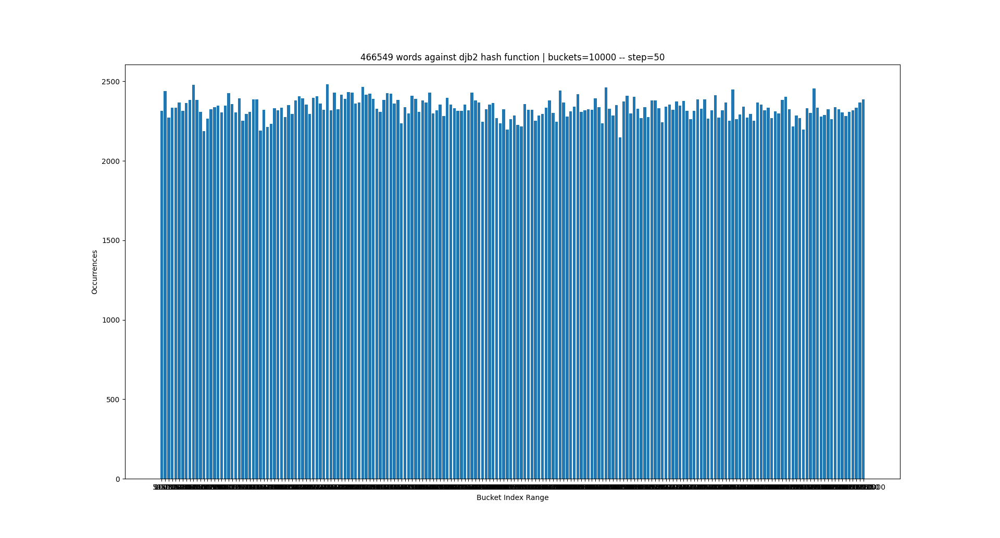
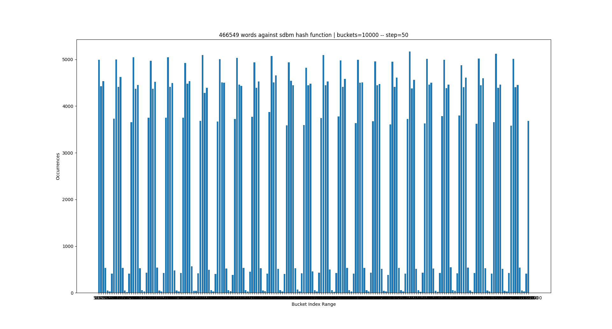
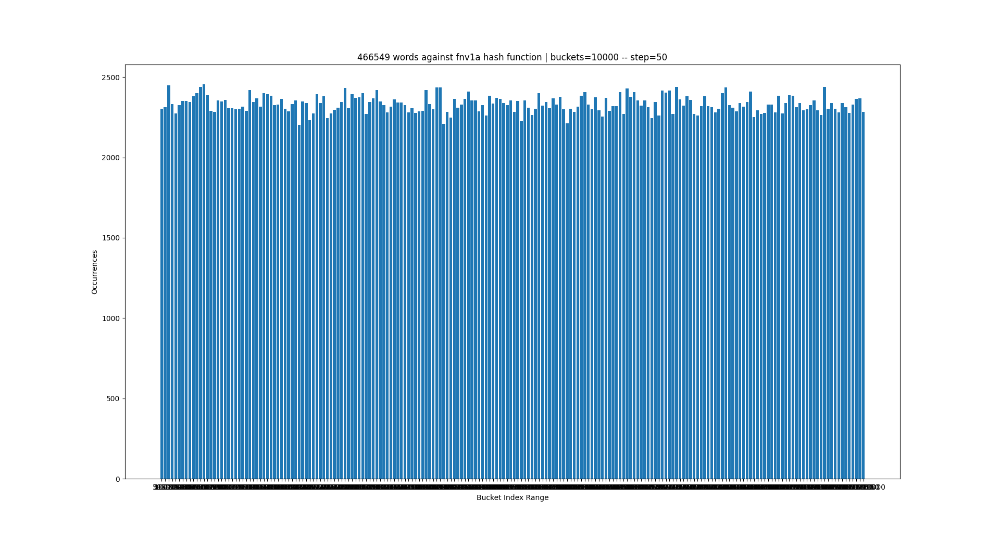
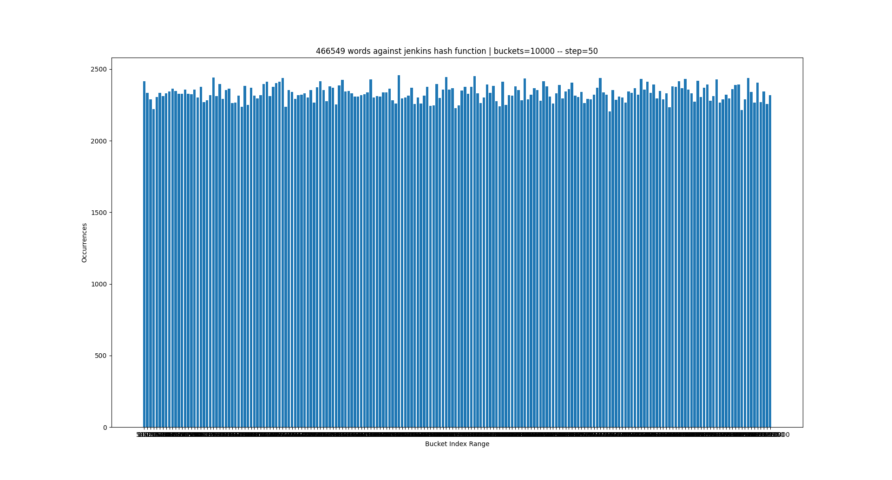
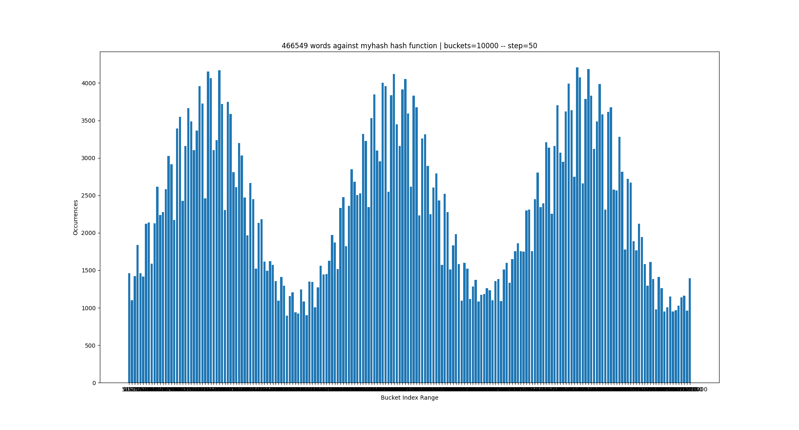
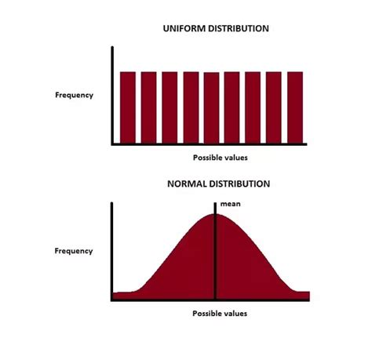

# Hashplot

This plots the distribution of bucket index ranges by the occurrences from a given hash function against a list of words and strings.

The current hash functions in this repository:

- [**loselose**](http://www.cse.yorku.ca/~oz/hash.html)
- [**djb2**](http://www.cse.yorku.ca/~oz/hash.html)
- [**sdbm**](http://www.cse.yorku.ca/~oz/hash.html)
- [**fnv-1a**](https://en.wikipedia.org/wiki/Fowler%E2%80%93Noll%E2%80%93Vo_hash_function)
- [**jenkins**](https://en.wikipedia.org/wiki/Jenkins_hash_function)
- [**myhash (terrible one)**]()

Normally, a pretty good hash function consists of [**uniform distribution**](https://en.wikipedia.org/wiki/Continuous_uniform_distribution). The function must generate hashes uniformly with low collisions. Follow the examples below:

> Tested with 10000 buckets and a range of 50

> Also tested with a list of **466549** words

### loselose



### djb2



### sdbm 



### fnv-1a



### jenkins



### myhash



## How to use

```bash
./plot.py [hash-function] [buckets] [index-range]
```

## Conclusion

As you can see, the examples with `djb2`, `fnv-1a` and `jenkins` are closer to the goal of good hash functions. Otherwise, the `loselose` and `myhash` are terrible.

> `loselose` is really really bad

> Both `myhash` and `loselose` are closer to a [**gaussian distribution**](https://en.wikipedia.org/wiki/Normal_distribution)


